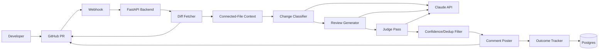

# High-Level Design (HLD)

## Architecture

## Components
| Component | Responsibility |
|---|---|
| FastAPI backend | Webhook receipt, signature verification, pipeline orchestration |
| Diff Fetcher | Retrieves changed files/hunks via GitHub API |
| Connected-File Context | Targeted search for files referencing changed code |
| Change Classifier | Tags each change (endpoint, schema, dependency, logic) |
| Review Generator | Produces structured findings via task-decomposed prompts |
| Judge Pass | Re-verifies each finding against actual code context |
| Confidence/Dedup Filter | Drops low-confidence and duplicate findings |
| Comment Poster | Posts a batched, severity-gated GitHub review |
| Outcome Tracker | Records accept/reject signal into Postgres |

## End-to-End Data Flow
1. Developer opens/updates a PR.
2. GitHub sends a `pull_request` webhook.
3. FastAPI verifies the signature and accepts the event.
4. Diff Fetcher retrieves changed files.
5. Connected-File Context retrieves related, unchanged files.
6. Change Classifier tags each file's change type.
7. Review Generator produces structured findings per tag.
8. Judge Pass discards ungrounded findings.
9. Confidence/Dedup Filter removes noise.
10. Comment Poster submits a batched review to GitHub.
11. Outcome Tracker records thread resolution/dismissal over time.

## Scalability
Single FastAPI service is sufficient at student-project scale. If review volume grew, the natural next step is a queue between webhook receipt and pipeline processing so GitHub's webhook delivery isn't blocked on LLM latency — not warranted at v1 scale.

## Reliability
- Timeouts on all LLM/GitHub API calls.
- Retry transient LLM failures once before failing the review gracefully.
- Skip (not crash on) binary files, lockfiles, and empty diffs.
- A failed review should not leave partial/duplicate comments on the PR.

## Security
- GitHub App permissions: PR read/write, contents read — nothing else.
- Webhook signature verification on every request.
- No code execution from PR content — static analysis only.
