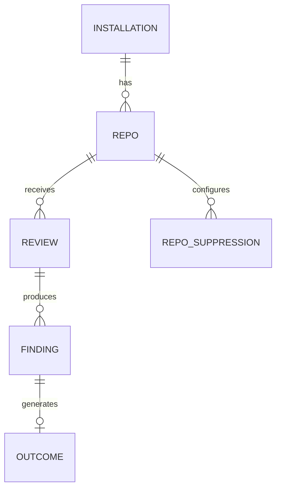

# Database / Data Design

## Core Tables

### installations
- `id`
- `github_installation_id`
- `account_login`
- `installed_at`

### repos
- `id`
- `installation_id`
- `full_name`
- `default_branch`
- `created_at`

### reviews
- `id`
- `repo_id`
- `pr_number`
- `status`
- `created_at`

### findings
- `id`
- `review_id`
- `file`
- `line`
- `severity`
- `category`
- `rationale`
- `confidence`
- `posted` (bool)

### outcomes
- `id`
- `finding_id`
- `repo_id`
- `category`
- `outcome` (accepted / rejected / ignored)
- `recorded_at`

### repo_suppressions
- `repo_id`
- `category`
- `suppressed` (bool)
- `updated_at`

## ER-style Relationships

## Indexes
- `repos.github_installation_id`.
- `reviews.repo_id + created_at`.
- `findings.review_id`.
- `outcomes.repo_id + category`.

## Data Lifecycle
Webhook received → review created → findings generated → filtered → posted → outcome recorded → *(v2)* suppression rules updated.

Use public open-source repos for evaluation; no private customer code is required for the student project.
