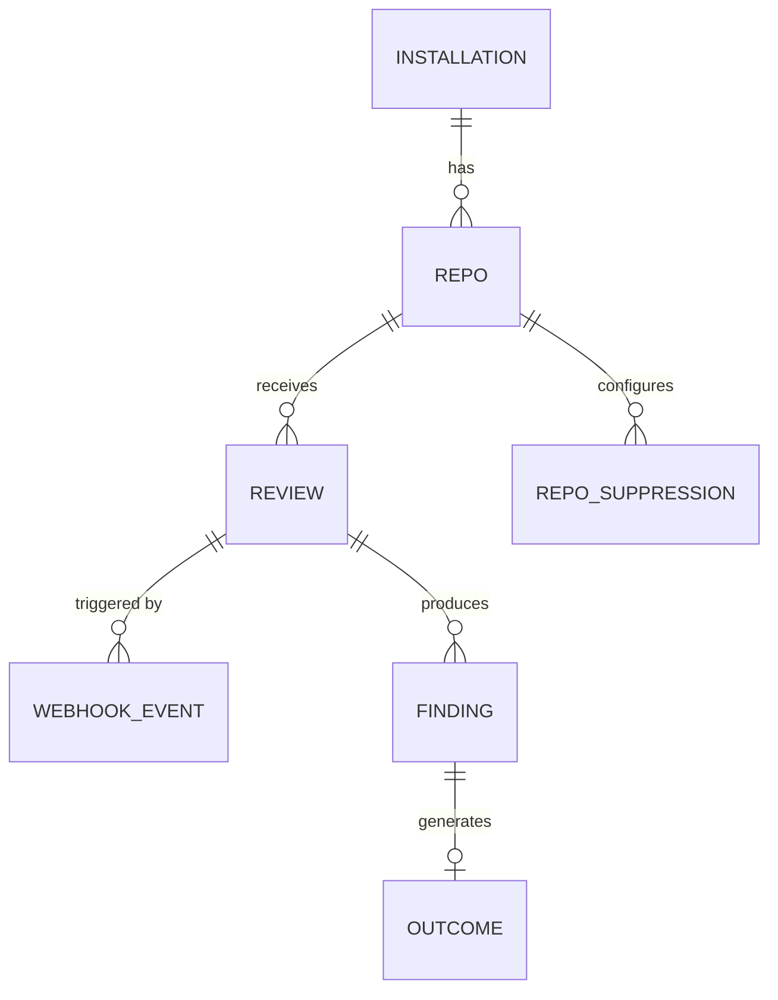

# Database / Data Design

## Core Tables

### installations
- `id`
- `github_installation_id`
- `account_login`
- `installed_at`

### repos
- `id`
- `installation_id`
- `full_name`
- `default_branch`
- `created_at`

### webhook_events
One row per authenticated delivery, including duplicates and ignored actions, so every delivery is accounted for. Requests that fail signature verification are not stored; they are logged only, so unauthenticated input never reaches the database. The full payload is not stored — only the fields that identify the event (see Security Design).
- `id`
- `delivery_id` — the `X-GitHub-Delivery` GUID, **unique**
- `event` — the `X-GitHub-Event` value, e.g. `pull_request`
- `action` — e.g. `opened`, `synchronize`
- `github_repo_id`
- `pr_number`
- `head_sha`
- `outcome` — `accepted` / `duplicate` / `ignored`
- `review_id` — nullable; the review this delivery created or was de-duplicated against
- `received_at`

### reviews
One row per unit of review work: one commit on one PR.
- `id`
- `repo_id`
- `pr_number`
- `head_sha` — the commit being reviewed
- `status` — see the review state machine in the LLD
- `attempts` — pipeline runs started; caps automatic recovery
- `error_code` — nullable; stable internal code when `status = failed`
- `github_review_id` — nullable; set once GitHub accepts the review
- `created_at`
- `updated_at` — refreshed on every status change; used to detect stuck reviews

**Constraint:** unique (`repo_id`, `pr_number`, `head_sha`). This is the review-level idempotency key.

### findings
- `id`
- `review_id`
- `file`
- `line`
- `severity`
- `category`
- `rationale`
- `confidence`
- `posted` (bool)

### outcomes
- `id`
- `finding_id`
- `repo_id`
- `category`
- `outcome` (accepted / rejected / ignored)
- `recorded_at`

### repo_suppressions
- `repo_id`
- `category`
- `suppressed` (bool)
- `updated_at`

## ER-style Relationships

```mermaid
erDiagram
    INSTALLATION ||--o{ REPO : has
    REPO ||--o{ REVIEW : receives
    REVIEW ||--o{ WEBHOOK_EVENT : "triggered by"
    REVIEW ||--o{ FINDING : produces
    FINDING ||--o| OUTCOME : generates
    REPO ||--o{ REPO_SUPPRESSION : configures
```

## Indexes
- `repos.github_installation_id`.
- `reviews.repo_id + created_at`.
- `webhook_events.delivery_id` (unique).
- `reviews.repo_id + pr_number + head_sha` (unique).
- `reviews.status + updated_at` — the stuck-review recovery scan.
- `findings.review_id`.
- `outcomes.repo_id + category`.

## Data Lifecycle
Webhook received and recorded → review claimed (or delivery marked duplicate/ignored) → findings generated → filtered → review posted → outcome recorded → *(v2)* suppression rules updated.

Use public open-source repos for evaluation; no private customer code is required for the student project.
