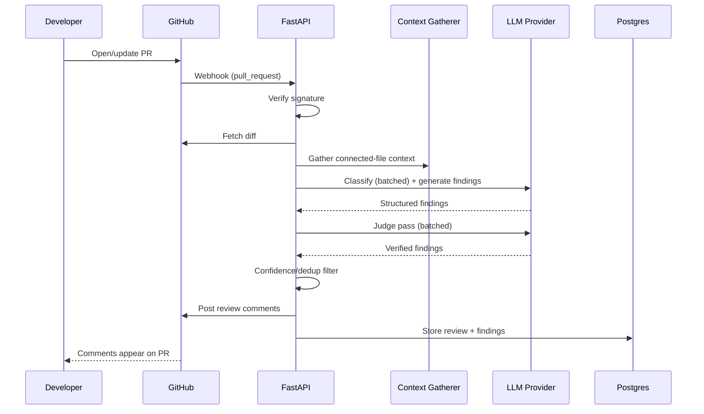

# Low-Level Design (LLD)

## Backend Modules
```text
src/
  webhooks/
  diff/
  context/
  classification/
  review/
  judge/
  filter/
  github/
  outcomes/
  common/
```

## Key Interfaces

### DiffFetcher
- `fetch(pr)`
- `parse(patch)`

### ContextGatherer
- `find_references(symbol, repo)`
- `build_context(files)`

### ChangeClassifier
- `classify(file_diff)`

### ReviewGenerator
- `select_template(change_type)`
- `generate(diff, context, template)`

### JudgePass
- `verify(finding, code_context)`

### ConfidenceFilter
- `filter(findings, threshold)`
- `dedupe(findings)`

### CommentPoster
- `post_review(pr, findings)`

## Sequence



## Design Patterns
- Adapter pattern for LLM provider abstraction — mandatory, not optional. Multiple free-tier providers are trialled, and different pipeline stages may run on different providers to spread request quota.
- Strategy pattern for per-change-type review templates.
- Repository pattern for Postgres persistence boundaries.
- Do not introduce patterns without a concrete need — this is a fixed pipeline, not an open-ended agent loop, so no agent-framework abstraction is used.

## Validation
Validate webhook signature, diff size limits, and structured LLM output schema before any finding is treated as real.

## Error Handling
All errors receive a stable internal code and request ID. A failed pipeline stage skips gracefully (e.g., context-gathering failure falls back to diff-only review) rather than failing the whole review.
