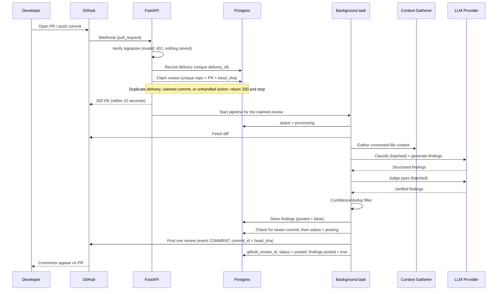
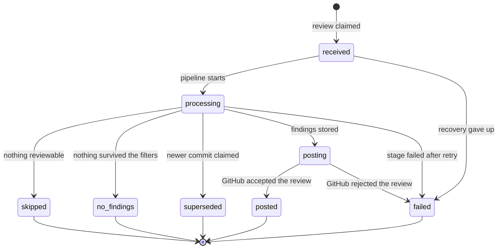

# Low-Level Design (LLD)

## Backend Modules
```text
src/
  webhooks/
  diff/
  context/
  classification/
  review/
  judge/
  filter/
  github/
  outcomes/
  common/
```

## Key Interfaces

### WebhookReceiver
- `verify_signature(raw_body, signature_header)`
- `record_delivery(delivery_id, event, action, repo, pr_number, head_sha)`

### ReviewStore
- `claim(repo_id, pr_number, head_sha)` — returns a review ID, or nothing if that commit is already claimed
- `transition(review_id, expected_status, new_status)` — applies only if the review is still in `expected_status`
- `has_newer_review(review_id)`
- `find_stuck(older_than)`

### DiffFetcher
- `fetch(pr)`
- `parse(patch)`

### ContextGatherer
- `find_references(symbol, repo)`
- `build_context(files)`

### ChangeClassifier
- `classify(file_diff)`

### ReviewGenerator
- `select_template(change_type)`
- `generate(diff, context, template)`

### JudgePass
- `verify(finding, code_context)`

### ConfidenceFilter
- `filter(findings, threshold)`
- `dedupe(findings)`

### CommentPoster
- `post_review(pr, head_sha, findings)`
- `find_existing_review(pr, head_sha)` — used by recovery before re-posting

## Sequence


```mermaid
sequenceDiagram
    participant D as Developer
    participant GH as GitHub
    participant API as FastAPI
    participant DB as Postgres
    participant BG as Background task
    participant CTX as Context Gatherer
    participant LLM as LLM Provider

    D->>GH: Open PR / push commit
    GH->>API: Webhook (pull_request)
    API->>API: Verify signature (invalid: 401, nothing stored)
    API->>DB: Record delivery (unique delivery_id)
    API->>DB: Claim review (unique repo + PR + head_sha)
    Note over API,DB: Duplicate delivery, claimed commit, or unhandled action: return 200 and stop
    API-->>GH: 200 OK (within 10 seconds)
    API->>BG: Start pipeline for the claimed review
    BG->>DB: status = processing
    BG->>GH: Fetch diff
    BG->>CTX: Gather connected-file context
    BG->>LLM: Classify (batched) + generate findings
    LLM-->>BG: Structured findings
    BG->>LLM: Judge pass (batched)
    LLM-->>BG: Verified findings
    BG->>BG: Confidence/dedup filter
    BG->>DB: Store findings (posted = false)
    BG->>DB: Check for newer commit, then status = posting
    BG->>GH: Post one review (event COMMENT, commit_id = head_sha)
    BG->>DB: github_review_id, status = posted, findings posted = true
    GH-->>D: Comments appear on PR
```

## Webhook Event State & Idempotency

### Why this is stored
- GitHub requires a 2XX response within 10 seconds, so the pipeline runs in a `BackgroundTasks` task after the response. That task lives inside the server process, so a crash or redeploy mid-review loses it silently. The stored review row is the only durable evidence that work was started.
- GitHub does not retry failed deliveries automatically, but duplicates still arrive. They come from manual redelivery, from redelivering missed events after downtime (GitHub's recommended practice), and from one PR producing several events in quick succession.

### Two idempotency keys
| Key | Stored on | Catches |
|---|---|---|
| `delivery_id` (`X-GitHub-Delivery`) | `webhook_events`, unique | The exact same delivery arriving twice |
| `repo_id` + `pr_number` + `head_sha` | `reviews`, unique | Different deliveries asking to review the same commit |

The commit key is the one that protects the PR. GitHub's documentation does not say whether a redelivered event keeps its original delivery ID, so correctness must not depend on the delivery key alone. Keying reviews on the commit also defines what "the same review" means: a push creates a new `head_sha` and therefore a new review, while a repeated event for an unchanged commit does not.

### Handled events
v1 reviews `pull_request` deliveries whose action is `opened` or `synchronize` (commits pushed to the PR). Every other action is recorded as `ignored` and creates no review. Handling `reopened` later is safe, because the commit key stops an already-reviewed commit from being reviewed again.

### Review state machine

```mermaid
stateDiagram-v2
    [*] --> received: review claimed
    received --> processing: pipeline starts
    received --> failed: recovery gave up
    processing --> skipped: nothing reviewable
    processing --> no_findings: nothing survived the filters
    processing --> superseded: newer commit claimed
    processing --> posting: findings stored
    processing --> failed: stage failed after retry
    posting --> posted: GitHub accepted the review
    posting --> failed: GitHub rejected the review
    posted --> [*]
    no_findings --> [*]
    skipped --> [*]
    superseded --> [*]
    failed --> [*]
```

| Status | Meaning | PRD product state |
|---|---|---|
| `received` | Claimed; pipeline not started | `WEBHOOK_RECEIVED` |
| `processing` | Pipeline running | `PROCESSING` |
| `posting` | Findings stored; GitHub call in progress | `PROCESSING` |
| `posted` | GitHub accepted the review | `REVIEW_POSTED` |
| `no_findings` | Pipeline finished, but no finding survived the judge pass and filters, so nothing was posted | `REVIEW_POSTED` (nothing to post) |
| `skipped` | Nothing reviewable: empty diff, or only binaries, lockfiles, or generated code (TEST-003, TEST-004) | — |
| `superseded` | A newer commit on the same PR was claimed before this review posted | — |
| `failed` | A stage failed after retry, or recovery gave up | `PROCESSING_FAILED` |

### Ordering rules
1. **Verify the signature before writing anything.** A missing or invalid signature returns `401` and is logged, never stored, so unauthenticated requests cannot fill the database.
2. **Record the delivery and claim the review before returning `200`.** Both are single inserts and fit easily inside GitHub's 10-second limit. Once GitHub has its `200`, the stored row is the only record that the work exists.
3. **A failed claim is not an error.** If the delivery ID or the commit key already exists, the delivery is recorded as `duplicate` and the endpoint still returns `200`.
4. **Store findings before posting them**, with `posted = false`.
5. **Check for a newer commit immediately before posting.** If a later review exists for the same PR, mark this one `superseded` and post nothing, because its line numbers may no longer match the code.
6. **Set `posting` before calling GitHub, and `posted` after.** A crash between the two leaves the review in `posting`, which tells recovery to check GitHub before posting again.
7. **Post exactly one review, with `event = COMMENT` and `commit_id = head_sha`.** Without `event`, GitHub leaves the review pending and invisible. Without `commit_id`, GitHub attaches the comments to the PR's latest commit, which may not be the commit that was reviewed. `APPROVE` and `REQUEST_CHANGES` are never used (ADR-005).
8. **Every status change is conditional.** `ReviewStore.transition` updates a review only if it is still in the expected status, so two workers can never both advance the same review.

### Recovery
On startup, and optionally on a timer, `ReviewStore.find_stuck` returns reviews in `received`, `processing`, or `posting` whose `updated_at` is more than 10 minutes old.
- **`received` or `processing`:** restart the pipeline if `attempts` is below 3. Otherwise mark the review `failed` with `error_code = REVIEW_STUCK`.
- **`posting`:** call `CommentPoster.find_existing_review` first. If the App already posted a review on that commit, record its ID and mark the review `posted`. Otherwise post again.

### Known gap: deliveries that never arrive
If the service cannot respond within 10 seconds, GitHub marks the delivery failed and may never deliver it. A free-tier cold start can take longer than that. Nothing above can recover a delivery that never reached the database. The mitigation follows GitHub's own advice: on startup, list the App's recent deliveries through GitHub's REST API and redeliver any that did not receive a 2XX. The duplicate protection above makes that redelivery safe.

### Timing
Week 1 has no database, so the webhook handler only logs `delivery_id`. The week-2 skeleton may post its placeholder comment without these protections, because duplicate comments on a test repository are harmless. Everything in this section must exist before real findings are posted in week 5.

## Design Patterns
- Adapter pattern for LLM provider abstraction — mandatory, not optional. Multiple free-tier providers are trialled, and different pipeline stages may run on different providers to spread request quota.
- Strategy pattern for per-change-type review templates.
- Repository pattern for Postgres persistence boundaries.
- Do not introduce patterns without a concrete need — this is a fixed pipeline, not an open-ended agent loop, so no agent-framework abstraction is used.

## Validation
Validate webhook signature, diff size limits, and structured LLM output schema before any finding is treated as real.

## Error Handling
All errors receive a stable internal code and request ID. A failed pipeline stage skips gracefully (e.g., context-gathering failure falls back to diff-only review) rather than failing the whole review.
