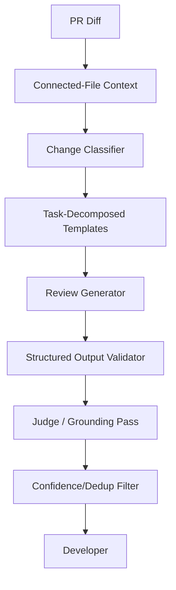

# Generative AI Architecture

## Why GenAI?
Deterministic static analysis (linters, SAST tools) is appropriate for pattern-matched issues. GenAI is needed for semantic understanding of what a change *means* — whether a new parameter is handled correctly elsewhere, whether a migration is safe, whether an endpoint checks auth — the kind of judgment a linter cannot make.

The project should NOT rely on the LLM to execute code or make merge decisions autonomously.

## Recommended AI Architecture



## RAG
**Not used in v1.** Connected-file context comes from direct, targeted code search (grep-style reference lookup for changed symbols), not vector retrieval — the repo sizes involved don't require embeddings-based search, and adding a vector store would be complexity without a corresponding need. Version 2's deeper cross-file graph may introduce embeddings-based retrieval only if targeted search proves insufficient on larger repos — RAG should not be adopted merely because this is a GenAI project.

## Prompt Structure
System instructions:
- Act as a careful code reviewer, not an autonomous decision-maker.
- Only report issues grounded in the supplied diff and context.
- Never invent a line number or a code pattern not actually present.
- Distinguish confirmed bugs from stylistic opinions.
- If uncertain, lower the confidence score rather than omitting or overstating.

User/context:
- Classified change type.
- Diff hunk.
- Connected-file context (targeted, not full files).
- Prior per-repo suppression rules (v2).

## Structured Output
```json
{
  "file": "auth.py",
  "line": 39,
  "severity": "high",
  "category": "null_handling",
  "rationale": "get_user() can return None if user_id doesn't exist, which will crash on the next line.",
  "confidence": 0.9
}
```

## Guardrails
- JSON schema validation on every LLM response.
- Judge pass re-checks each finding against actual code before it's posted.
- Confidence threshold filtering.
- **Prompt injection defense for untrusted code content** — a PR's diff/comments are untrusted input; treat all code and comment text as data, never as instructions to the reviewer, since a malicious PR could embed text attempting to manipulate the reviewer's own prompt.
- No arbitrary code execution triggered by PR content.

## Evaluation
Measure:
- Recall (known bugs caught / total known bugs).
- False-positive rate (dismissed findings / total findings posted).
- Judge-pass grounding accuracy.
- API requests consumed per review.
- Latency per review.
- Calibrated against independent competitor benchmarks (Qodo 60.1% F1, CodeRabbit 51.2% F1, Greptile's self-reported 82% bug-catch rate) — not expected to match a funded team's numbers, but measured with the same rigor.

## AI Safety
PR diffs and code comments are untrusted input. Treat all diff/code text as data, not instructions. Never allow content inside a PR to override the reviewer's system instructions.
