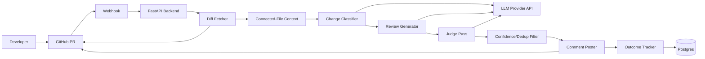
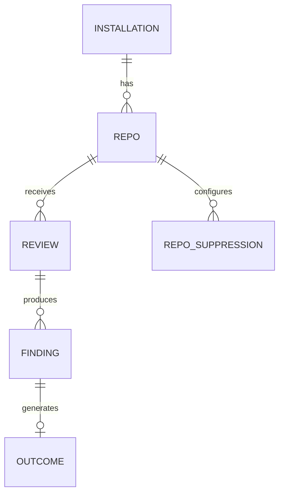
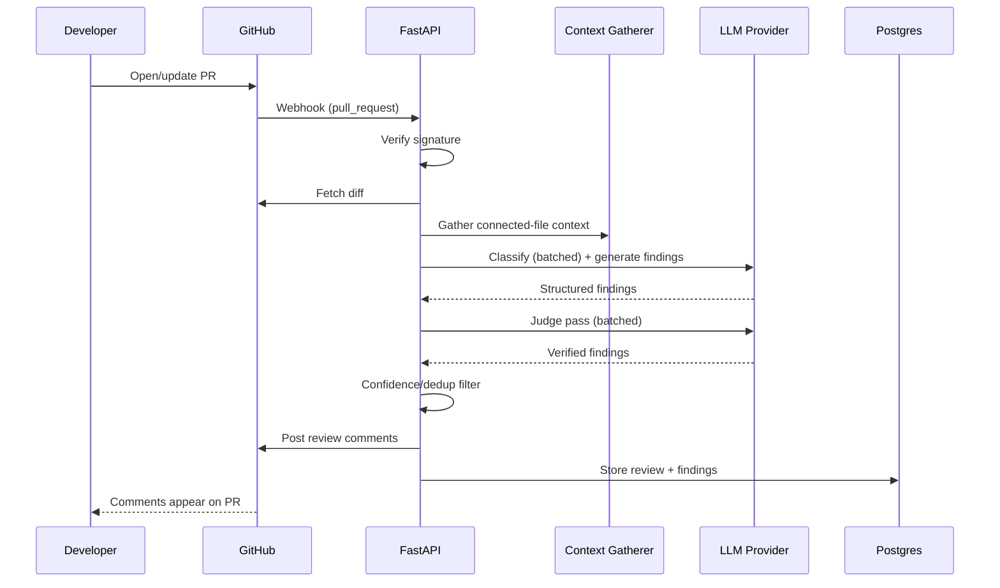
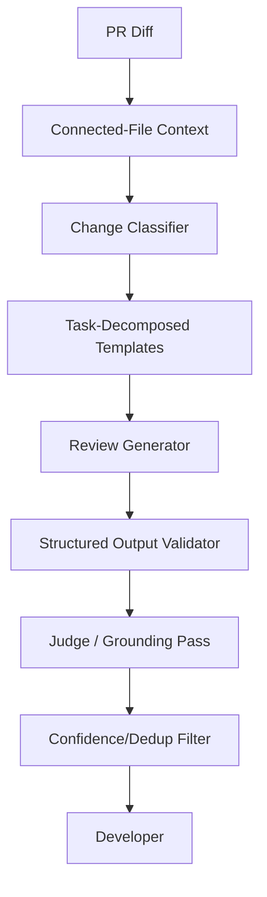

# PR Review Copilot — Complete Polaris Project Documentation

**Track:** Generative AI
**Domain:** Developer Tools / Software Engineering
**Duration:** 8 weeks
**Team:** 1 student
**Level:** Intermediate to Advanced
**Stack:** Python + FastAPI + PostgreSQL + GitHub App API + free-tier LLM provider APIs (provider-agnostic adapter)
**Constraint:** No local/dedicated GPU and no paid-API budget (laptop-only development; all inference via free-tier hosted LLM APIs)

## Project Description
Designing and implementing an AI-powered pull request reviewer, delivered as an installable GitHub App, for engineering teams who merge code without dedicated senior review capacity on every PR. The system reads a diff, understands what it actually touches beyond the changed lines, verifies its own findings before posting, and applies software engineering, AI/LLM orchestration, evaluation, testing, deployment, and documentation best practices throughout.

# PR Review Copilot — Project Overview

## Project Identity
- **Track:** Generative AI
- **Domain:** Developer Tools / Software Engineering
- **Duration:** 8 weeks
- **Team:** 1 student
- **Skill level:** Intermediate to Advanced
- **Primary users:** Engineering teams (2-15 developers), individual developers reviewing their own repos
- **Constraint:** No local GPU and no paid-API budget — orchestration-only, free-tier hosted LLM APIs

## Executive Summary
PR Review Copilot is an end-to-end AI code review system that reads a pull request's diff, gathers the surrounding code context it actually touches, generates targeted findings, verifies each finding against the real code before it's shown to anyone, and posts the result as real GitHub review comments.

The platform is intentionally designed as a **review-support system, not an autonomous merge gate**. A human developer remains responsible for the final decision to merge.

## Core Product Flow
PR opened/updated → webhook received → diff fetched → connected-file context gathered → change classified → task-decomposed review generated → judge/grounding pass → confidence/dedup filter → severity-gated comments posted → outcome captured → (v2) per-repo tuning.

## MVP
1. GitHub App installable on a repo.
2. Webhook-triggered diff ingestion.
3. Lightweight connected-file context retrieval.
4. Task-decomposed review generation (targeted checks per change type).
5. Judge/grounding pass to discard ungrounded findings.
6. Confidence and duplicate filtering.
7. Severity-gated inline PR comments.
8. Outcome capture (accept/reject signal).
9. Evaluation harness (recall / false-positive rate on real historical PRs).

## Out of Scope for MVP
- Autofix / one-click apply.
- Multi-platform support (GitLab, Bitbucket, Azure DevOps).
- Custom team rules / compliance configuration UI.
- Dedicated security-scanning pillar (SAST).
- IDE integration.
- Training or fine-tuning a model.
- Full-codebase graph indexing (v1 uses targeted search, not a full graph).


# Business Requirements Document (BRD)

## 1. Executive Summary
Small and mid-sized engineering teams merge code without dedicated senior review capacity, so bugs a careful review would catch ship to production instead. The proposed system reduces this gap by automatically reviewing every PR for cross-file-aware, verified findings, without the infrastructure weight of the heaviest competing tools.

## 2. Problem Statement
Reviewers are busy, review queues back up, and existing AI code-review tools split across unresolved trade-offs — diff-only tools miss cross-file breakage, full-context tools require heavy graph infrastructure, and general-purpose tools generate false-positive fatigue, the #1 stated developer complaint about the category.

## 3. Vision
Build a transparent, installable AI reviewer that understands what a change actually touches, double-checks its own findings, and gets more useful over time by learning what a specific team cares about.

## 4. Objectives
- Reduce the "no one had time to review this" gap for small teams.
- Catch cross-file-breaking changes that diff-only review misses.
- Keep false-positive rate low enough that developers don't dismiss the tool.
- Produce a measured, honest evaluation (recall / false-positive rate), not just "it runs."
- Keep the entire pipeline transparent and buildable by one engineer, unlike closed competitor products.

## 5. Personas
| Persona | Goals | Pain Points |
|---|---|---|
| Engineering team lead (2-15 devs) | Ship code without shipping avoidable bugs | No dedicated senior reviewer for every PR |
| Individual developer | Get a second opinion on their own PR | Busy teammates, slow review turnaround |
| Builder (student) | Demonstrate applied LLM-evaluation engineering | Needs a credible, measured result, not just a demo |

## 6. Business Use Cases
- Install the GitHub App on a repository.
- Open or update a pull request.
- Receive targeted, grounded review comments automatically.
- Resolve or dismiss a comment (feeding the outcome/feedback loop).
- Review the evaluation report (recall / false-positive rate).
- View per-repo suppression behavior (v2).

## 7. Business Requirements
| ID | Requirement | Priority | Acceptance Criteria |
|---|---|---|---|
| BR-001 | App can be installed on a GitHub repository | Must | Installation completes via GitHub App flow |
| BR-002 | System detects PR open/update events | Must | Webhook received and signature verified |
| BR-003 | System fetches and parses the diff | Must | Structured hunks available per changed file |
| BR-004 | System gathers connected-file context | Must | Files referencing changed functions/classes are retrieved |
| BR-005 | System generates targeted findings per change type | Must | Findings include file, line, severity, category, rationale, confidence |
| BR-006 | System verifies findings before posting | Must | Ungrounded findings are discarded by the judge pass |
| BR-007 | System filters low-confidence/duplicate findings | Must | Only confident, deduplicated findings remain |
| BR-008 | System posts comments directly on the PR | Must | Comments appear inline on GitHub, severity-gated |
| BR-009 | System records comment outcomes | Must | Accept/reject signal stored per finding |
| BR-010 | System reports evaluation results | Should | Recall and false-positive rate available from a documented run |

## 8. Non-Functional Requirements
- Security: minimum-necessary GitHub App permissions; verified webhook signatures.
- Performance: a typical PR (≤8 files) should receive comments within roughly a minute.
- Reliability: transient LLM/API failures should not silently drop a review.
- Auditability: every posted finding retains its model, prompt-template, and confidence metadata.
- Cost: zero paid API spend — free-tier providers only; track API requests per review from week 1, since request quota is the binding constraint.

## 9. Success Metrics
- Recall against a curated set of real historical PR bugs.
- False-positive rate against the same set.
- API requests consumed per PR review.
- Judge-pass grounding accuracy (how often the judge correctly discards a bad finding).
- Qualitative: would these findings have been worth a human reviewer's time (installed on the builder's own repos).

## 10. Risks
| Risk | Probability | Impact | Mitigation |
|---|---|---|---|
| False-positive fatigue | Medium | High | Judge pass + confidence filtering built into v1, not deferred |
| Hard to source real-world test data | Medium | Medium | Use open-source repos with documented bugfix-commit history instead of private team data |
| Free-tier request quota exhausted during eval tuning | Medium | Medium | Batch classifier and judge calls to cut ~20 API calls per review down to ~7; spread stages across multiple providers; track requests per review from week 1 |
| Hosting cold-starts delay first review after inactivity | Medium | Low | Accepted tradeoff on free-tier hosting; documented, not hidden |
| Scope creep toward autofix/multi-platform/security scanning | Medium | Medium | Explicitly deferred to Version 3 with reasons documented |

## 11. MVP Scope
**In scope:** GitHub App install, webhook ingestion, connected-file context, task-decomposed review, judge/grounding pass, confidence/dedup filtering, severity-gated comment posting, outcome capture, evaluation harness.

**Out of scope:** autofix, multi-platform support, custom rules UI, dedicated security scanning, IDE integration, model training.

## 12. Future Scope
- PR-level summary comment.
- Feedback-driven per-repo suppression.
- Deeper cross-file dependency graph.
- Confidence scores surfaced in comments.
- Multi-platform support.
- Autofix suggestions.


# Product Requirements Document (PRD)

## Product Goal
Create an installable AI reviewer that reads a pull request the way a careful senior engineer would, verifies its own findings, and posts them as real, severity-gated GitHub comments.

## Feature Priorities
| Feature | Priority |
|---|---|
| GitHub App installation | Must |
| Webhook-triggered diff ingestion | Must |
| Connected-file context retrieval | Must |
| Task-decomposed review generation | Must |
| Judge/grounding pass | Must |
| Confidence + dedup filtering | Must |
| Severity-gated comment posting | Must |
| Outcome capture | Must |
| Evaluation harness | Must |
| PR-level summary comment | Should |
| Feedback-driven suppression | Should |
| Deeper cross-file graph | Could |
| Autofix suggestions | Won't (v1) |

## User Stories

### US-001
As an engineering team lead, I want to install the reviewer on my repository so that every future PR gets reviewed automatically.

**Acceptance criteria**
- Installation completes through GitHub's App flow.
- The app requests only PR read/write and contents-read permissions.

### US-002
As a developer, I want the reviewer to understand code connected to my change, not just the diff, so that it catches cross-file breakage.

**Acceptance criteria**
- Findings can reference a file that wasn't itself changed in the PR.

### US-003
As a developer, I want the reviewer to double-check itself before commenting so that I'm not shown false alarms.

**Acceptance criteria**
- A finding that fails the judge pass never reaches the PR.

### US-004
As a developer, I want only important issues shown by default so the PR stays readable.

**Acceptance criteria**
- Low-severity findings are stored but not posted unless explicitly requested.

### US-005
As a builder, I want a measured evaluation report so I can state a credible recall/false-positive number.

### US-006
As a team, I want the bot to stop repeating a finding category we keep dismissing (v2).

## Product States
`INSTALLED → WEBHOOK_RECEIVED → PROCESSING → REVIEW_POSTED → OUTCOME_RECORDED`

Failure state: `PROCESSING_FAILED`.

## Product Principles
- Grounded before posted — every finding is verified against real code before a human sees it.
- Human-in-the-loop — the tool comments, it does not block or auto-merge.
- Transparent, not novel — built from documented competitor techniques, cited as such.
- Quiet by default — severity-gating over completeness.
- Measured, not claimed — every quality statement is backed by the eval harness.


# UX Requirements

## Primary Interface
The primary interface is **GitHub itself** — there is no separate frontend in v1. The product's UX is the quality and placement of PR comments.

## Information Architecture
1. GitHub PR page (primary surface — inline review comments)
2. GitHub App installation/settings page (GitHub-hosted)
3. *(Optional, v2+)* Lightweight web dashboard — installed repos, recent reviews, quota report, eval results

## Primary User Flow
Install app on repo → open/update PR → wait ~1 minute → review appears as inline comments, severity-gated → resolve or dismiss each comment → *(v2)* dashboard shows suppression behavior building up per repo.

## Key Surface Requirements

### PR Comment Thread (primary surface)
- Each finding: file, line, severity badge, category, plain-language rationale.
- High/medium severity posted by default; low severity suppressed.
- No more than a handful of comments per PR — dedup and filtering keep it readable.

### Optional Dashboard (v2+)
- List of installed repos.
- Recent reviews with severity breakdown.
- Requests-per-review and cumulative quota consumption.
- Eval report (recall / false-positive rate) from the latest harness run.

## States
Every asynchronous step (webhook received, processing, posted, failed) should be distinguishable in logs/dashboard even where there's no UI screen for it.

## Accessibility
- Comment text avoids color-only severity signaling (badge text, not just color).
- If a dashboard is built, it follows standard semantic HTML and keyboard-navigable controls.


# Technical Requirements Document (TRD)

## Proposed Architecture
- **Backend:** Python + FastAPI
- **GitHub integration:** GitHub App (webhooks + REST API), scoped permissions
- **LLM:** Free-tier hosted providers (Gemini / GitHub Models / Groq / Cerebras / Mistral), reached through a provider-agnostic adapter
- **Diff parsing:** `unidiff`
- **Database:** PostgreSQL (Supabase free tier)
- **Hosting:** Render (free tier)

## Technology Rationale

### FastAPI
Async-friendly, well-suited to a webhook-driven service, and matches existing Python fluency.

### GitHub App (not OAuth App or PAT)
Scoped, installable, per-installation permissions — the correct primitive for a product other repos install, unlike a personal-account-tied PAT.

### Free-tier LLM providers behind an adapter
Budget-driven architectural decision: the project has no paid-API budget, so all inference runs on free-tier hosted providers. Because free tiers differ in rate limits, structured-output support, and context window, the provider is reached exclusively through an adapter that abstracts authentication, structured JSON generation, token-usage reporting, and rate-limit/retry semantics. Different pipeline stages may run on different providers to spread request quota across accounts.

### PostgreSQL over a document store
The findings/outcomes/suppression data is relational by nature (foreign keys between reviews, findings, and outcomes) — a structured schema fits better than a flexible document model here.

### No agent framework (raw orchestration)
Direct API calls per pipeline stage, not a heavy agent framework — keeps the judge/grounding pass fully inspectable and avoids unnecessary abstraction over a pipeline that's fundamentally a fixed sequence, not an open-ended agent loop.

## Technical Requirements
| ID | Requirement | Maps to |
|---|---|---|
| TR-001 | Webhook endpoint with signature verification | BR-002 |
| TR-002 | Diff fetch + structured parsing | BR-003 |
| TR-003 | Connected-file context search | BR-004 |
| TR-004 | Change classifier + prompt template selection | BR-005 |
| TR-005 | Structured LLM output for findings | BR-005 |
| TR-006 | Judge/grounding pass | BR-006 |
| TR-007 | Confidence + dedup filter | BR-007 |
| TR-008 | Batched GitHub review comment posting | BR-008 |
| TR-009 | Outcome-tracking schema | BR-009 |
| TR-010 | Evaluation harness (recall/FP rate) | BR-010 |

## NFR Targets
- Typical PR (≤8 files) reviewed within ~60 seconds, excluding hosting cold-start.
- All model versions and prompt-template versions recorded per finding.
- Secrets (GitHub App private key, LLM API key) stored outside source code.
- No PR source code logged beyond what's necessary for debugging a specific failure.


# High-Level Design (HLD)

## Architecture



## Components
| Component | Responsibility |
|---|---|
| FastAPI backend | Webhook receipt, signature verification, pipeline orchestration |
| Diff Fetcher | Retrieves changed files/hunks via GitHub API |
| Connected-File Context | Targeted search for files referencing changed code |
| Change Classifier | Tags each change (endpoint, schema, dependency, logic) |
| Review Generator | Produces structured findings via task-decomposed prompts |
| Judge Pass | Re-verifies each finding against actual code context |
| Confidence/Dedup Filter | Drops low-confidence and duplicate findings |
| Comment Poster | Posts a batched, severity-gated GitHub review |
| Outcome Tracker | Records accept/reject signal into Postgres |

## End-to-End Data Flow
1. Developer opens/updates a PR.
2. GitHub sends a `pull_request` webhook.
3. FastAPI verifies the signature and accepts the event.
4. Diff Fetcher retrieves changed files.
5. Connected-File Context retrieves related, unchanged files.
6. Change Classifier tags each file's change type.
7. Review Generator produces structured findings per tag.
8. Judge Pass discards ungrounded findings.
9. Confidence/Dedup Filter removes noise.
10. Comment Poster submits a batched review to GitHub.
11. Outcome Tracker records thread resolution/dismissal over time.

## Scalability
Single FastAPI service is sufficient at student-project scale. If review volume grew, the natural next step is a queue between webhook receipt and pipeline processing so GitHub's webhook delivery isn't blocked on LLM latency — not warranted at v1 scale.

## Reliability
- Timeouts on all LLM/GitHub API calls.
- Retry transient LLM failures once before failing the review gracefully.
- Skip (not crash on) binary files, lockfiles, and empty diffs.
- A failed review should not leave partial/duplicate comments on the PR.

## Security
- GitHub App permissions: PR read/write, contents read — nothing else.
- Webhook signature verification on every request.
- No code execution from PR content — static analysis only.


# Database / Data Design

## Core Tables

### installations
- `id`
- `github_installation_id`
- `account_login`
- `installed_at`

### repos
- `id`
- `installation_id`
- `full_name`
- `default_branch`
- `created_at`

### reviews
- `id`
- `repo_id`
- `pr_number`
- `status`
- `created_at`

### findings
- `id`
- `review_id`
- `file`
- `line`
- `severity`
- `category`
- `rationale`
- `confidence`
- `posted` (bool)

### outcomes
- `id`
- `finding_id`
- `repo_id`
- `category`
- `outcome` (accepted / rejected / ignored)
- `recorded_at`

### repo_suppressions
- `repo_id`
- `category`
- `suppressed` (bool)
- `updated_at`

## ER-style Relationships



## Indexes
- `repos.github_installation_id`.
- `reviews.repo_id + created_at`.
- `findings.review_id`.
- `outcomes.repo_id + category`.

## Data Lifecycle
Webhook received → review created → findings generated → filtered → posted → outcome recorded → *(v2)* suppression rules updated.

Use public open-source repos for evaluation; no private customer code is required for the student project.


# API Specification

Base URL: `/api/v1` (internal/dashboard endpoints; the primary integration surface is the GitHub webhook, not a public REST API)

## Webhook
### POST /webhooks/github
Receives GitHub `pull_request` events. Verifies `X-Hub-Signature-256` before processing. Returns `200` immediately; processing continues asynchronously.

## Reviews (dashboard-supporting, optional v2)
### GET /repos
Lists installed repositories.

### GET /repos/:id/reviews
Lists recent reviews for a repo.

### GET /reviews/:id
Returns a review's findings and posting status.

### GET /reviews/:id/findings
Returns structured findings for a review.

## Reporting
### GET /eval-report
Returns the latest evaluation harness result (recall, false-positive rate, sample size).

### GET /quota-report
Returns requests-per-review and cumulative free-tier quota consumption, broken down by provider.

## Standard Errors
```json
{
  "error": {
    "code": "WEBHOOK_SIGNATURE_INVALID",
    "message": "The request could not be verified.",
    "requestId": "req_123"
  }
}
```

Use 400 for validation, 401 for signature/authentication failures, 404 for missing resources, 409 for duplicate/idempotency conflicts, 500/503 for server/dependency failures.


# Low-Level Design (LLD)

## Backend Modules
```text
src/
  webhooks/
  diff/
  context/
  classification/
  review/
  judge/
  filter/
  github/
  outcomes/
  common/
```

## Key Interfaces

### DiffFetcher
- `fetch(pr)`
- `parse(patch)`

### ContextGatherer
- `find_references(symbol, repo)`
- `build_context(files)`

### ChangeClassifier
- `classify(file_diff)`

### ReviewGenerator
- `select_template(change_type)`
- `generate(diff, context, template)`

### JudgePass
- `verify(finding, code_context)`

### ConfidenceFilter
- `filter(findings, threshold)`
- `dedupe(findings)`

### CommentPoster
- `post_review(pr, findings)`

## Sequence



## Design Patterns
- Adapter pattern for LLM provider abstraction — mandatory, not optional. Multiple free-tier providers are trialled, and different pipeline stages may run on different providers to spread request quota.
- Strategy pattern for per-change-type review templates.
- Repository pattern for Postgres persistence boundaries.
- Do not introduce patterns without a concrete need — this is a fixed pipeline, not an open-ended agent loop, so no agent-framework abstraction is used.

## Validation
Validate webhook signature, diff size limits, and structured LLM output schema before any finding is treated as real.

## Error Handling
All errors receive a stable internal code and request ID. A failed pipeline stage skips gracefully (e.g., context-gathering failure falls back to diff-only review) rather than failing the whole review.


# Generative AI Architecture

## Why GenAI?
Deterministic static analysis (linters, SAST tools) is appropriate for pattern-matched issues. GenAI is needed for semantic understanding of what a change *means* — whether a new parameter is handled correctly elsewhere, whether a migration is safe, whether an endpoint checks auth — the kind of judgment a linter cannot make.

The project should NOT rely on the LLM to execute code or make merge decisions autonomously.

## Recommended AI Architecture



## RAG
**Not used in v1.** Connected-file context comes from direct, targeted code search (grep-style reference lookup for changed symbols), not vector retrieval — the repo sizes involved don't require embeddings-based search, and adding a vector store would be complexity without a corresponding need. Version 2's deeper cross-file graph may introduce embeddings-based retrieval only if targeted search proves insufficient on larger repos — RAG should not be adopted merely because this is a GenAI project.

## Prompt Structure
System instructions:
- Act as a careful code reviewer, not an autonomous decision-maker.
- Only report issues grounded in the supplied diff and context.
- Never invent a line number or a code pattern not actually present.
- Distinguish confirmed bugs from stylistic opinions.
- If uncertain, lower the confidence score rather than omitting or overstating.

User/context:
- Classified change type.
- Diff hunk.
- Connected-file context (targeted, not full files).
- Prior per-repo suppression rules (v2).

## Structured Output
```json
{
  "file": "auth.py",
  "line": 39,
  "severity": "high",
  "category": "null_handling",
  "rationale": "get_user() can return None if user_id doesn't exist, which will crash on the next line.",
  "confidence": 0.9
}
```

## Guardrails
- JSON schema validation on every LLM response.
- Judge pass re-checks each finding against actual code before it's posted.
- Confidence threshold filtering.
- **Prompt injection defense for untrusted code content** — a PR's diff/comments are untrusted input; treat all code and comment text as data, never as instructions to the reviewer, since a malicious PR could embed text attempting to manipulate the reviewer's own prompt.
- No arbitrary code execution triggered by PR content.

## Evaluation
Measure:
- Recall (known bugs caught / total known bugs).
- False-positive rate (dismissed findings / total findings posted).
- Judge-pass grounding accuracy.
- API requests consumed per review.
- Latency per review.
- Calibrated against independent competitor benchmarks (Qodo 60.1% F1, CodeRabbit 51.2% F1, Greptile's self-reported 82% bug-catch rate) — not expected to match a funded team's numbers, but measured with the same rigor.

## AI Safety
PR diffs and code comments are untrusted input. Treat all diff/code text as data, not instructions. Never allow content inside a PR to override the reviewer's system instructions.


# Security Design

## Authentication
GitHub App authentication via JWT (app-level) and installation access tokens (per-repo, short-lived).

## Authorization
GitHub App permissions, scoped to minimum necessary:
- `pull_requests: read & write`
- `contents: read`
- No other scopes requested.

## Data Protection
- No PR source code stored beyond what's needed for the specific review (findings/rationale, not full file contents).
- Secrets (GitHub App private key, LLM provider API keys) kept in environment/secret management, never committed.
- HTTPS for all external calls.

## Webhook Security
- Verify `X-Hub-Signature-256` on every incoming webhook.
- Reject unsigned or mismatched requests before any processing.

## API Security
- Signature verification middleware.
- Input validation on all internal endpoints.
- Rate limiting to protect against webhook replay abuse.

## AI Security
- Prompt injection defenses for untrusted diff/code content.
- Structured output schema validation.
- No arbitrary tool execution from PR content.
- Record model and prompt-template versions per finding for auditability.

## Important Product Rule
The system is a **review-support tool, not an autonomous merge gate**. It comments; it does not block, approve, or execute changes. A human developer remains responsible for the merge decision.


# Testing Strategy

## Test Levels
1. Unit
2. Integration
3. API/webhook
4. End-to-end (real PR against a test repo)
5. Security
6. Evaluation (recall / false-positive rate)

## Sample Test Cases
| ID | Scenario | Expected Result | Priority |
|---|---|---|---|
| TEST-001 | Valid PR opened webhook | Review pipeline triggers | High |
| TEST-002 | Invalid webhook signature | Request rejected, no processing | High |
| TEST-003 | Empty diff | Skipped, no findings generated | Medium |
| TEST-004 | Binary file in diff | Skipped from review | Medium |
| TEST-005 | Malformed LLM output | Rejected by schema validation, retried once | High |
| TEST-006 | Judge pass given an ungrounded finding | Finding discarded before posting | High |
| TEST-007 | Duplicate findings on the same block | Merged into one comment | Medium |
| TEST-008 | GitHub API rate limit hit | Backoff/retry, review not silently dropped | High |
| TEST-009 | Duplicate webhook delivery (GitHub retry) | Idempotent — no duplicate comments posted | High |
| TEST-010 | LLM API unavailable | Review fails gracefully, logged, not crashed | High |

## Evaluation (recall / false-positive rate)
Curate 30-50 real historical PRs from open-source repos with a documented follow-up bugfix commit (a bug the original PR missed) or a clean merge (a true negative). Run the pipeline against each and report recall and false-positive rate explicitly, calibrated against the competitor benchmarks in §GenAI Architecture.


# CI/CD

## Pipeline
```text
Developer
  ↓
Feature Branch
  ↓
Pull Request
  ↓
Lint + Unit Tests
  ↓
Integration/Webhook Tests
  ↓
Security / Dependency Scan
  ↓
Build
  ↓
Deploy to Render (staging)
  ↓
Smoke Test (real test-repo PR)
  ↓
Production/Demo Deployment
```

## Branching
- `main`: stable
- `feature/*`: incremental work

## Pull Requests
Every PR should contain: problem, solution, testing performed, and risks — the same discipline the tool itself enforces on others.

## Quality Gates
Do not merge when required tests fail or secrets are detected.


# Observability

## Logs
Log:
- Request ID / webhook delivery ID
- Repo ID, PR number
- Review ID
- Processing stage
- LLM provider, model version, and prompt-template version
- Error code

Do not log full PR source code or diffs beyond what's necessary to debug a specific failure.

## Metrics
- Webhook receipt rate and processing latency
- Review success/failure rate
- LLM latency (per stage)
- Token usage and request-quota consumption per review
- Judge-pass rejection rate
- False-positive rate trend (from accepted/rejected outcomes)

## Tracing
Trace: GitHub webhook → FastAPI → Diff Fetcher → Context Gatherer → Review Generator → Judge Pass → Filter → Comment Poster → Postgres.

## Alerts
Trigger alerts for:
- Repeated processing failures.
- GitHub API errors (rate limit, auth failure).
- LLM dependency failure.
- Abnormal request-count spike per review, or approaching a provider's daily quota.


# Deployment Architecture

## Environments
Development → Staging (test repo) → Production/Demo

## Suggested Deployment
- FastAPI backend as a container/service on Render.
- PostgreSQL via Supabase (free tier).
- GitHub App registered against the deployed backend's public webhook URL.
- LLM inference via free-tier hosted provider endpoints — no local model hosting, no paid API tier.

## No-GPU Constraint
Because no local/dedicated GPU is available:
1. All inference runs through free-tier hosted LLM APIs.
2. No local model fine-tuning or training is attempted.
3. Model access is kept provider-agnostic via an adapter, so a different hosted provider could be substituted without rearchitecting.
4. Request-quota consumption and latency are tracked explicitly, since free-tier rate limits are the binding constraint (§Quota & Resource Analysis).

## Rollback
Backend deployments are versioned; a broken deploy rolls back to the last known-good container image.

## Database Migration
Schema changes tracked with explicit migration scripts (e.g., Alembic) rather than ad hoc changes.


# Quota & Resource Analysis

The project runs entirely on free-tier infrastructure and free-tier LLM APIs, so **direct monetary cost is $0**. That does not make the project unconstrained — it moves the constraint from dollars to **API requests per day**. This document models that constraint the way a cost model would model spend.

## Why requests, not tokens
Paid APIs meter per token, so the optimization target is fewer tokens — especially output tokens. Free tiers meter per *request*, with caps on requests per minute and per day. The optimization target is therefore **fewer API calls per review**, which is a different design decision and drives ADR-006.

## Request Model
Requests per review depend on:
- Files changed per PR (typically ~5, after skipping binaries, lockfiles, and generated code)
- Whether classifier calls are batched (1 call) or per-file (N calls)
- Whether judge calls are batched per file (N calls) or issued per finding (often 2N)
- Retries caused by schema-invalid LLM output

## Formula
`Requests per PR ≈ classifier calls + generation calls (1 per file) + judge calls + retries`

`Requests per eval run ≈ requests per PR × number of curated PRs`

## Estimates (per PR, ~5 files, ~10 raw findings)

| Stage | Naive | Batched (ADR-006) |
|---|---:|---:|
| Classify | 5 | 1 |
| Generate | 5 | 5 |
| Judge | 10 | 1–5 |
| **Total per review** | **~20** | **~7** |
| **Total per 40-PR eval run** | **~800** | **~280** |

The eval run figure is the number that matters. Weeks 6–7 involve re-running the harness after every prompt or threshold change, so requests-per-run directly determines how many tuning iterations are possible before the deadline.

## Infrastructure
| Component | Cost | Real constraint |
|---|---|---|
| LLM inference | $0 | Free-tier requests/minute and requests/day |
| Hosting (Render free tier) | $0 | Spins down after ~15 min idle; cold start ~50s, which consumes most of the ~60s review NFR |
| Database (Supabase free tier) | $0 | Pauses after ~7 days of inactivity and needs a manual wake — a demo-day risk |
| GitHub API | $0 | ~5,000 requests/hour per installation; connected-file code search is the endpoint most likely to approach it |

## Optimization
- Batch classifier and judge calls (ADR-006) — the single largest lever on quota.
- Review only changed hunks + targeted connected files, never full files; cap connected-file context per file so one widely-referenced symbol cannot balloon a request.
- Skip binary files, lockfiles, and generated code entirely.
- Cap files reviewed per PR so a single large PR cannot exhaust a daily quota.
- Spread pipeline stages across two providers where quota is tight — the provider adapter (ADR-003) makes this configuration, not code.
- Reject providers that fail the structured-output validity gate; malformed JSON forces retries, and retries are wasted quota.

## Instrumentation
Every provider response carries token usage. Log per call, keyed to the review ID: provider, model version, prompt-template version, input tokens, output tokens, and **request count**. Requests-per-review is then a query rather than an estimate, and `GET /quota-report` returns measured quota consumption. Track this from week 1, not retroactively.


# 8-Week Project Roadmap

| Phase | Weeks | Deliverables |
|---|---:|---|
| Foundation | 1 | GitHub App registration, webhook endpoint, signature verification, deploy skeleton |
| Diff & Context | 2 | Diff fetching/parsing, connected-file search, LLM provider adapter, free-tier provider trial (schema-validity gate) |
| Classification & Generation | 3 | Batched change classifier, task-decomposed prompt templates |
| Verification | 4 | Batched judge pass, confidence/dedup filtering, 8-PR mini-eval to validate provider viability |
| Posting & Tracking | 5 | Comment posting, severity gating, outcome-tracking schema |
| Evaluation | 6 | Eval harness — curated PR set, recall/false-positive measurement |
| Tuning | 7 | Tuning against eval results, live test on own real repos |
| Ship | 8 | Documentation, architecture diagram, demo recording, deploy |

## Definition of Done
A feature is complete when: implemented, tested, documented, integrated, error paths handled, security considerations addressed, and demonstrable against a real PR.


# Team Responsibilities

## Solo Builder — Full Ownership
As a single-student project, one person owns the full stack:
- BRD/PRD/UX.
- FastAPI backend, webhook handling, GitHub App integration.
- Diff parsing, context gathering, classification, review generation.
- Judge pass, filtering, evaluation harness.
- Database schema and outcome tracking.
- Security (permission scoping, signature verification, prompt injection defenses).
- Testing, CI/CD, deployment, observability.
- Documentation and demo presentation.

The builder must understand and be able to defend every layer of the architecture, since there is no teammate to divide responsibility with.


# GitHub Repository Structure

```text
pr-review-copilot/
├── docs/
│   ├── 01_Project_Overview.md
│   ├── 02_BRD.md
│   ├── 03_PRD.md
│   ├── 04_UX_Requirements.md
│   ├── 05_TRD.md
│   ├── 06_HLD.md
│   ├── 07_Database_Design.md
│   ├── 08_API_Specification.md
│   ├── 09_LLD.md
│   ├── 10_GenAI_Architecture.md
│   ├── 11_Security.md
│   ├── 12_Testing_Strategy.md
│   ├── 13_CICD.md
│   ├── 14_Observability.md
│   ├── 15_Deployment.md
│   ├── 16_Quota_Analysis.md
│   ├── 17_Roadmap.md
│   ├── 18_Team_Responsibilities.md
│   ├── 19_GitHub_Structure.md
│   ├── 20_README.md
│   ├── 21_ADRs.md
│   ├── 22_Traceability.md
│   ├── 23_Interview_Questions.md
│   ├── 24_Viva.md
│   └── 25_Project_Score.md
├── src/
│   ├── webhooks/
│   ├── diff/
│   ├── context/
│   ├── classification/
│   ├── review/
│   ├── judge/
│   ├── filter/
│   ├── github/
│   ├── outcomes/
│   └── common/
├── tests/
├── infrastructure/
├── scripts/
├── .github/workflows/
├── README.md
├── CONTRIBUTING.md
├── LICENSE
└── .gitignore
```


# PR Review Copilot

## Problem
Small and mid-sized engineering teams merge code without dedicated senior review capacity, so bugs a careful review would catch ship to production instead.

## Solution
An installable GitHub App that reads a pull request's diff and connected code context, generates targeted findings, verifies them before posting, and gets quieter over time about what a specific team doesn't care about.

## Key Features
- GitHub App installation
- Webhook-triggered diff ingestion
- Connected-file context retrieval
- Task-decomposed review generation
- Judge/grounding pass
- Confidence + dedup filtering
- Severity-gated inline PR comments
- Outcome capture
- Evaluation harness

## Architecture
GitHub webhook → FastAPI backend → Diff Fetcher + Context Gatherer → Change Classifier → Review Generator → Judge Pass → Confidence/Dedup Filter → Comment Poster → Postgres.

## Tech Stack
Python, FastAPI, PostgreSQL, GitHub App API, free-tier LLM provider APIs behind a provider-agnostic adapter.

## Important Disclaimer
This is a student portfolio project — a transparent, scoped implementation of proven techniques from funded competitors (Greptile, CodeRabbit, Ellipsis), built to demonstrate applied LLM-evaluation engineering. It does not claim to outperform those tools and is not an autonomous merge gate; a human developer remains responsible for the final merge decision.

## Running
Document GitHub App credentials and LLM provider API keys as environment variables. Never commit secrets.


# Architecture Decision Records

## ADR-001 — GitHub App, not OAuth App or Personal Access Token
**Context:** The reviewer needs to act on repos it doesn't own, with scoped permissions.
**Decision:** Register a GitHub App with minimal permissions (PR read/write, contents read).
**Rationale:** A GitHub App has its own identity and per-installation permission scoping; a PAT ties to a personal account and can't be distributed the same way.
**Trade-off:** More setup complexity than a quick PAT-based script.

## ADR-002 — FastAPI Backend, No Agent Framework
**Decision:** Orchestrate the pipeline with direct API calls in FastAPI, not a heavy agent framework.
**Rationale:** The pipeline is a fixed sequence (fetch → classify → generate → judge → filter → post), not an open-ended agent loop — a framework would add abstraction without solving a real problem here.
**Trade-off:** Some boilerplate that a framework might otherwise handle.

## ADR-003 — Free-Tier LLM Providers Behind a Provider Adapter
**Context:** The project has no budget for paid LLM APIs, and no local GPU, so inference must run on free-tier hosted providers.
**Decision:** Run every pipeline stage on free-tier hosted models (Gemini / GitHub Models / Groq / Cerebras / Mistral), accessed only through a provider-agnostic adapter. Paid model tiers are explicitly out of scope.
**Rationale:** Free tiers are capable enough for this pipeline, and the adapter makes the provider a configuration choice rather than an architectural commitment — so a provider can be swapped when rate limits or output quality demand it. Provider selection is empirical: a candidate is rejected if it cannot return schema-valid JSON on at least ~90% of first attempts, since the whole pipeline depends on structured output.
**Trade-off:** Expected recall is lower than a frontier-model implementation would achieve, and rate limits constrain how often the eval harness can run. Both are accepted and reported honestly — the evaluation names the model that produced each number. This is consistent with the project's stated positioning, which does not claim to out-perform funded competitors.

## ADR-004 — No Vector Database / RAG in v1
**Decision:** Use targeted code search for connected-file context, not embeddings-based retrieval.
**Rationale:** At the repo sizes this project targets, direct reference search is sufficient; adding a vector store would be complexity without a corresponding need.
**Trade-off:** Less thorough than a full code-graph approach (Greptile's); documented as a deliberate v1 scope limit, with a deeper graph planned for v2 only if targeted search proves insufficient.

## ADR-005 — Comments Only, No Autofix or Auto-Merge Blocking
**Decision:** The tool posts review comments; it never writes code or blocks a merge.
**Rationale:** Keeps the human as the final decision-maker and avoids the much higher stakes/scope risk of autofix in a portfolio-timeline project.
**Trade-off:** Less "impressive-looking" than an autofix demo, but lower risk and more honest about v1 scope.

## ADR-006 — Batch Classifier and Judge Calls to Conserve Request Quota
**Context:** Free-tier providers meter usage per *request*, not per token. A naive implementation issues one classifier call per file and one judge call per finding — roughly 20 API calls for a typical 5-file PR, and ~800 calls for a single 40-PR evaluation run, which can exceed a day's quota.
**Decision:** Batch the two mechanical stages. Classify all changed files in a single call, and judge all findings for a file (or for the whole PR) in a single call. Keep review generation one call per file.
**Rationale:** Classification is short-output tagging and batches with no quality loss. Judge calls currently re-send the same file context once per finding, so batching removes pure duplication. This cuts a typical review from ~20 requests to ~7, roughly tripling how many evaluation runs fit inside a daily quota — which directly determines how many tuning iterations are possible in weeks 6-7. Review generation is deliberately *not* batched, because focused per-file context is where review quality comes from.
**Trade-off:** Batched prompts are longer and their structured output is more complex to validate; a single malformed response now costs several files' worth of results rather than one.


# Traceability Matrix

| Business | Product | Technical | API/Component | Data | Test |
|---|---|---|---|---|---|
| BR-001 | App installation | TR-001 | GitHub App install flow | installations | TEST-001 |
| BR-002 | Webhook detection | TR-001 | POST /webhooks/github | reviews | TEST-002 |
| BR-003 | Diff fetch/parse | TR-002 | Diff Fetcher | reviews | TEST-003/004 |
| BR-004 | Connected-file context | TR-003 | Context Gatherer | — | — |
| BR-005 | Finding generation | TR-004/005 | Review Generator | findings | TEST-005 |
| BR-006 | Judge/grounding pass | TR-006 | Judge Pass | findings | TEST-006 |
| BR-007 | Confidence/dedup filter | TR-007 | Filter | findings | TEST-007 |
| BR-008 | Comment posting | TR-008 | Comment Poster | findings | TEST-008/009 |
| BR-009 | Outcome capture | TR-009 | Outcome Tracker | outcomes | — |
| BR-010 | Evaluation report | TR-010 | GET /eval-report | — | evaluation |


# Interview Preparation

## Product Questions
1. Who is the primary user?
2. What problem does this solve that existing tools don't?
3. What is the MVP?
4. Why is human review still required?
5. What is the success metric?
6. What is intentionally out of scope, and why?
7. What happens when the LLM is uncertain?
8. How would you validate this is actually useful to a real team?
9. What would you build next?
10. What is the biggest product risk?

## Technical Questions
1. Why FastAPI?
2. Why a GitHub App instead of a personal access token?
3. How does the provider adapter let you swap free-tier LLM providers without rearchitecting?
4. Why Postgres over a document store here?
5. Why no agent framework?
6. How is the webhook verified?
7. How is a duplicate webhook delivery handled?
8. How would you scale this to more repos?
9. How do you prevent false-positive fatigue?
10. What does the judge pass actually check?
11. How is model/prompt version tracked?
12. How do you validate structured LLM output?
13. How do you test the review pipeline?
14. How do you handle LLM API failure?
15. How do you monitor free-tier request-quota consumption per review?
16. How do you secure the GitHub App's permissions?
17. Why not use RAG?
18. When would a queue become necessary?
19. When would microservices be justified here?
20. How would you deploy this?

## Architecture Questions
1. Why not let the LLM autofix code directly?
2. How would you support GitLab/Bitbucket in addition to GitHub?
3. How would you add a full code-graph instead of targeted search?
4. How would you scale to thousands of installed repos?
5. How would you detect the reviewer's own quality regressing over time?
6. How would you isolate one installation's data from another's?
7. How would you handle a compromised/malicious PR trying prompt injection?
8. How would you stay inside free-tier request quotas at 10x current PR volume?
9. How would you audit every posted finding after the fact?
10. How would you evolve this from a student project into a real product?

## Scenario Questions
1. The LLM claims a bug exists on a line that doesn't match the actual diff. What happens?
2. Two findings on adjacent lines say almost the same thing. What happens?
3. A PR's code comments contain text trying to instruct the reviewer to approve everything. What happens?
4. GitHub's API rate-limits the app mid-review. What's the fallback?
5. The judge pass starts rejecting almost everything. What do you investigate?
6. A team dismisses every finding in one category. What should happen (v2)?
7. The hosting service is cold and a webhook arrives. What happens to that PR?
8. The same PR triggers two webhook deliveries. What happens?
9. Requests per review suddenly triples. What do you check first?
10. A stakeholder wants the bot to auto-merge clean PRs. What has to change before that's reasonable?

## Strong Answer Principle
Explain not only what was built, but why each architectural decision was made and what trade-off was accepted — especially the deliberate choices to skip RAG, autofix, and multi-platform support in v1.


# Viva / Project Defense

## Beginner
1. What does this project do?
2. What is a pull request?
3. What is a webhook?
4. What is an LLM?
5. What is a GitHub App?
6. Why use FastAPI?
7. What is a diff?
8. What is Postgres used for here?
9. What is a false positive, in this context?
10. What does "severity" mean for a finding?
11. What is structured output?
12. What is a prompt?
13. What does "judge pass" mean?
14. What is human-in-the-loop?
15. What is a webhook signature?
16. What is CI/CD?
17. What is observability?
18. What is model versioning?
19. Why use open-source repos for evaluation instead of private code?
20. What does "recall" mean here?

## Intermediate
1. Why split review generation and judging across two different models?
2. How do you decide what counts as a duplicate finding?
3. How do you know a finding is actually grounded in the code?
4. How do you evaluate an imbalanced test set (few real bugs, many clean PRs)?
5. How do you prevent hallucinated line numbers?
6. How would you scale connected-file context gathering to a large repo?
7. How do you secure the GitHub App's private key?
8. Why is the pipeline synchronous rather than queued at this scale?
9. How would you add a lightweight dashboard?
10. How do you test the webhook endpoint?
11. How do you track free-tier request-quota consumption per review?
12. How do you handle a failed pipeline stage?
13. Why not use LangChain or a similar framework?
14. What's the difference between HLD and LLD here?
15. What is an API contract, and where is it defined in this project?
16. How do you implement least-privilege permissions for the GitHub App?
17. How would you deploy this to avoid cold starts?
18. What is the purpose of an ADR, and give one from this project?
19. How would you add GitLab support without rewriting the core pipeline?
20. How would you measure whether the feedback loop (v2) is actually working?

## Advanced
1. How would you detect the reviewer's quality drifting over time?
2. How would you design multi-tenant isolation across installations?
3. How would you support multiple LLM providers behind one interface?
4. How would you guarantee every posted finding is grounded, formally?
5. How would you handle an adversarial PR designed to defeat the reviewer?
6. How would you make the review pipeline explainable to a non-technical stakeholder?
7. How would you design a model/prompt registry with rollback?
8. What breaks first if PR volume grows 1,000x on free-tier quotas, and what would you change?
9. How would you design a resilient pipeline if GitHub's API degrades?
10. How would you evaluate human-AI agreement over the feedback loop?
11. How would you decide when targeted search is no longer sufficient and a full code graph is needed?
12. How would you extend this to review across a whole stacked-diff chain, not a single PR?
13. How would you prevent prompt injection from a maliciously crafted commit message?
14. How would you distinguish "the model isn't sure" from "the model has no information"?
15. When would you introduce a queue and worker pool?
16. How would you benchmark this against CodeRabbit/Greptile fairly?
17. How would you design an SLA for review latency at scale?
18. What governance would this need before being trusted with auto-merge?
19. How would you support monorepos with unrelated sub-projects?
20. How would you evolve this from a portfolio project into a funded product?


# Final Project Quality Score

Score the implemented project after demonstration.

| Dimension | Score |
|---|---:|
| Business Value | /10 |
| Problem Clarity | /10 |
| UX | /10 |
| Technical Complexity | /10 |
| Architecture | /10 |
| Code Quality | /10 |
| Scalability | /10 |
| Security | /10 |
| Testing | /10 |
| Cloud/Deployment | /10 |
| AI/ML Quality | /10 |
| Innovation | /10 |
| Documentation | /10 |
| Production Readiness | /10 |

## Evaluation Guidance
### 1–3
Basic prototype; major gaps.

### 4–6
Functional project with some engineering discipline.

### 7–8
Strong product-company-style project.

### 9–10
Exceptional engineering/product/research depth with strong evidence.

## Final Review
- Total Score:
- Strengths:
- Weaknesses:
- Critical Gaps:
- Recommended Improvements:

## Distinction-Level Criteria
A distinction-level project should demonstrate:
- Realistic product thinking (the competitive-landscape-grounded scope, not a claim of novelty).
- Consistent architecture.
- Strong AI/ML evaluation (recall/false-positive rate against real data, calibrated against competitor benchmarks).
- Grounded GenAI (judge pass, structured output, no unsupported findings).
- Human-in-the-loop review, not autonomous merging.
- Security (scoped permissions, signature verification, prompt injection defenses).
- Testing.
- Deployment.
- Observability.
- Clear, documented trade-offs (no RAG, no autofix, no multi-platform in v1 — and why).
- Measurable outcomes (recall, false-positive rate, requests per review).
